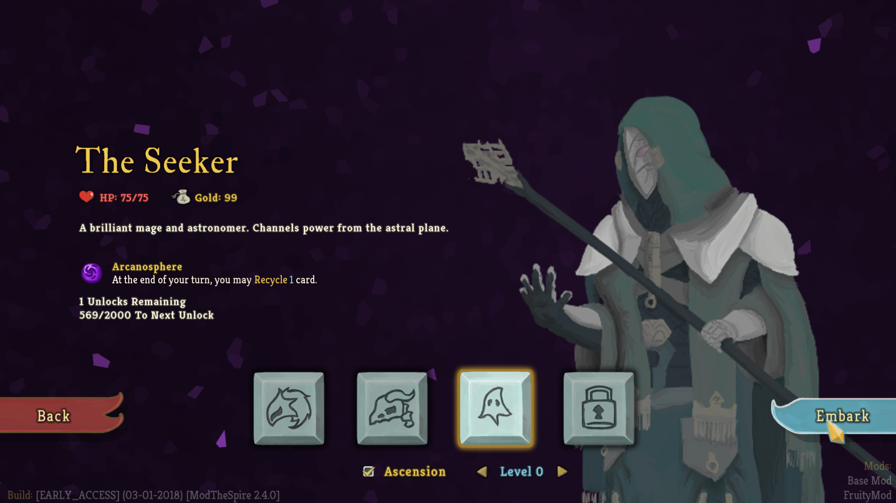
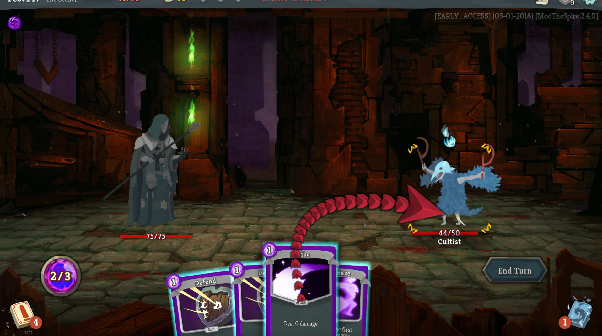
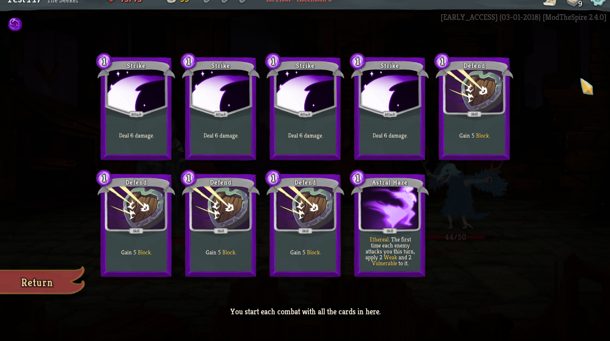
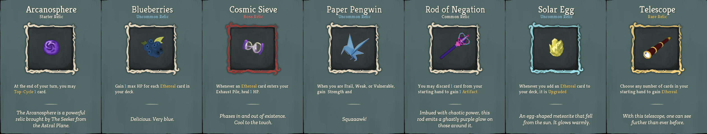
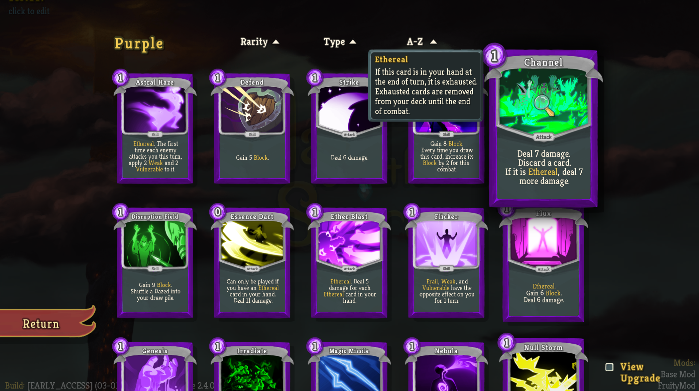

# FruityMod-StS
**Fruity Mod** for **Slay The Spire**

## Content/Gameplay ##
**Fruity Mod** for **Slay The Spire** adds an entirely new character class, **The Seeker**, and a new set of 75 cards for him to use. **The Seeker** is a purple colored combination mage/astronomer that uses power from the Astral Plane to cast his spells upon himself and his enemies.

**The Seeker** focuses on utilizing Ethereal cards and new cards in his deck that combine with the Ethereal keyword to make powerful effects. He also can gain strong ablities by debuffing himself or his enemies.

**The Seeker** is an entirely new playable character. He does not overwrite The Ironclad or The Silent. This mod makes no changes to the base game other than adding **The Seeker**.

## Current State ##
Currently **The Seeker** is completely playable. We have art for all the cards but it is currently just color adjusted versions of base game assets until we can find an artists. We're still looking for an artist so if you want to do that make a `Github Issue` so we can talk to you about it. Also we are well aware that **The Seeker** is not fully balanced yet. We are doing our best to balance him in line with The Ironclad and The Silent.

## Roadmap ##
1. Make necessary balance changes to **The Seeker**, fix any bugs discovered for the cards used by **The Seeker** and finish art for **The Seeker**
2. Add some new relics to use as unlocks for **The Seeker** and add some new relics specific to **The Seeker**
3. Maybe another character... maybe more potions... maybe more events... (we're not really sure about where we're going after **The Seeker** is done)

## The Seeker











Card list: [click here](https://fiiiiilth.github.io/seeker/cardlist.html). Generated using [twanvl's Exporter](https://github.com/twanvl/sts-exporter).

## Requirements ##
#### General Use ####
* Java 8 (JRE). Currently only Java 8 should be used, issues with Java 9 are being looked into.
* BaseMod v.1.8.0+ (https://github.com/daviscook477/BaseMod/releases)
* ModTheSpire v2.3.0+ (https://github.com/kiooeht/ModTheSpire/releases)

## Installation ##
1. Download `ModTheSpire.jar` from the latest release (https://github.com/kiooeht/ModTheSpire/releases) and save it in the base folder of this project (the base folder is the same folder containing this README).
2. Copy `desktop-1.0.jar` from your Slay the Spire installation folder into the base folder of this project.
3. Create a `mods` folder under the base folder of this project.
4. Download `BaseMod.jar` from the latest release (https://github.com/daviscook477/BaseMod/releases) and save it in the `mods` folder you created in step 3.
5. Get the `FruityMod.jar` and save it in the `mods` folder you created in step 3.  You have 2 options to do this:
    1. Build this project (see below).  Each time you build the project successfully, it will automatically be moved into the `mods` folder.
    2. Alternatively, you can download `FruityMod.jar` from the latest release (https://github.com/gskleres/FruityMod-StS/releases)
6. Your modded version of **Slay The Spire** can now be launched by double-clicking on `ModTheSpire.jar`
7. This will open a mod select menu where you need to make sure that both `BaseMod` and `FruityMod` are checked before clicking **play**

Here is a great video showing how to install mods, by Xterminator: https://www.youtube.com/watch?v=r2m2aL1eEjw

## Credits / Acknowledgements ##
* Fruitstrike (https://github.com/gskleres) for game design, project management, and being a hype train
* ColdRain451 (https://github.com/dvalldejuli) for a ton of card implementations and getting the code base started
* test447 (https://github.com/daviscook477) for card implementations and adding lots of needed API hooks to BaseMod 
* fiiiiilth (https://github.com/fiiiiilth) for testing, bug fixes and card updates/implementations
* Pal (https://github.com/Paltorz) for testing and feedback
* Grumpai (@Grumpai on Discord) for the current character model
* Jrawly (@Jrawly on Discord) for character concept art
* Butcherberries (@Butcherberries on Discord) for card art
* LikeAWass, Celerity, JohnDruitt, Zoochz, SirJesterful, and Jimquisitive for playtesting and feedback

## Special Thanks ##
1. Thanks to the [devs](https://www.megacrit.com/) of **SlayTheSpire** for making such and awesome game, allowing us to mod it, and allowing us to use recolored versions of their art assets in our mod
2. Thanks to t-larson and contributors (https://github.com/t-larson) for BaseMod!!
3. Thanks to kiooeht and contributors (https://github.com/kiooeht) for ModTheSpire!!
4. Thanks to all the people who have contributed bug reports or feedback on Discord or through the Github tracker. Without your help we couldn't make **The Seeker** as well-polished!

## Art Assets ##
Creative Commons and other licenses are great and helped make some of this mod happen.
1. Power Cells relic art - (https://www.goodfreephotos.com/) (https://www.goodfreephotos.com/vector-images/simple-battery-vector-clipart.png.php)
2. Mechanical Core relic art - (https://pixabay.com/en/spiral-circle-swirl-whorl-design-33987/)

## Notes For Contributors ##

#### Development ####
* Java 8
* Maven
* CFR 124 (run this with Java 8, doesn't work well with 9)
* BaseMod v.1.7.0+
* ModTheSpire v2.2.1+
* ModTheSpireLib (whatever version is associated with your version of ModTheSpire)

### Building ##
1. Run `mvn package` to make the jar `FruityMod.jar`.  Maven will automatically move this jar into your mod folder, so that you can test it out by playing a game.

#### Building in Eclipse ###
1. Right click on the project in eclipse then go to `configure` and `convert to maven project`
2. Then to build the project use `Run as` and select `Maven build` and specify `package` as the `Goal` for the build
3. If you get an error about lacking a compiler change the default `jre` for Eclipse to point to a `jdk` instead. The Eclipse Maven plugin is weird like that.

### Some notes about adding custom cards ##
1. With cards, you need to set `this.baseDamage` and `this.baseBlock` when assigning damage values or block values to a card. This is because the game will compute `this.damage` and `this.block` from those values before doing any damage or block actions. **HOWEVER** when setting magic numbers on cards you must set `this.baseMagicNumber` **AND** `this.magicNumber` otherwise the first time the card is used its magic number will be wrong because the game **does not** compute `this.magicNumber` before it is used (it defaults to -1).
2. Try to keep the damage values, block values, etc... to `static final` constants at the top of the file so it's easier to make edits to the cards for balancing.
3. If you have an `ethereal` card it needs to override the `triggerOnEndOfPlayerTurn` hook and add in code that looks like this:
```java
public void triggerOnEndOfPlayerTurn() {
	AbstractDungeon.actionManager.addToTop(new ExhaustSpecificCardAction(this, AbstractDungeon.player.hand));
}
```
