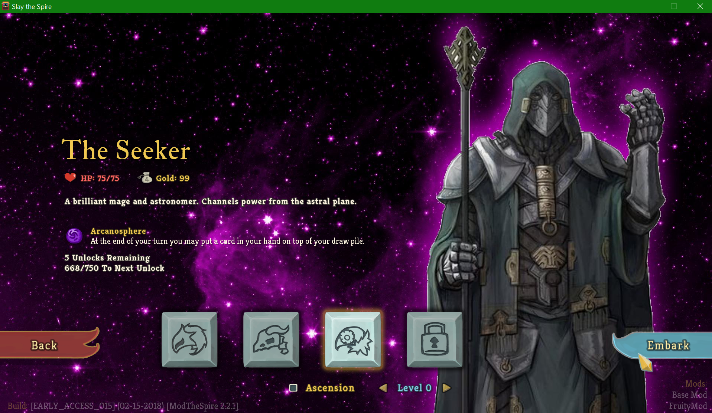
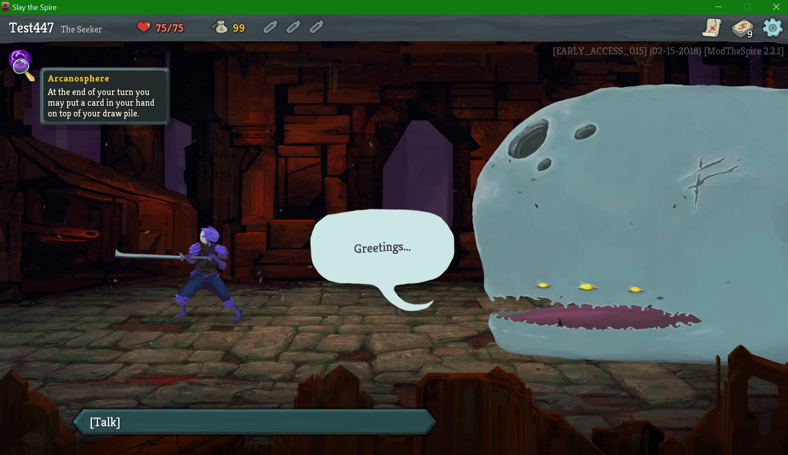
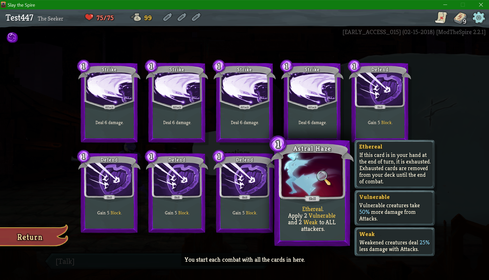

# FruityMod-StS
**Fruity Mod** for **Slay The Spire**

## Content/Gameplay ##
**Fruity Mod** for **Slay The Spire** adds an entirely new character class, **The Seeker**, and a new set of 75 cards for him to use. **The Seeker** is a purple colored combination mage/astronomer that uses power from the Astral Plane to cast his spells upon himself and his enemies.

**The Seeker** focuses on utilizing Ethereal cards and new cards in his deck that combine with the Ethereal keyword to make powerful effects. He also can gain strong ablities by debuffing himself or his enemies.

**The Seeker** is an entirely new playable character. He does not overwrite The Ironclad or The Silent. This mod makes no changes to the base game other than adding **The Seeker**.

## Current State ##
Currently **The Seeker** is completely playable. We have art for all the cards but it is currently just color adjusted versions of base game assets until we can find an artists. We're still looking for an artist so if you want to do that make a `Github Issue` so we can talk to you about it. Also we are well aware that **The Seeker** is not fully balanced yet. We are doing our best to balance him in line with The Ironclad and The Silent.

## Roadmap ##
1. Make necessary balance changes to **The Seeker**, fix any bugs discovered for the cards used by **The Seeker** and finish art for **The Seeker**
2. Add some new relics to use as unlocks for **The Seeker** and add some new relics specific to **The Seeker**
3. Maybe another character... maybe more potions... maybe more events... (we're not really sure about where we're going after **The Seeker** is done)

## The Seeker







Card list: [click here](https://drive.google.com/file/d/1aojRAKPQCbDW7mSW6Co6XTKwbB8IlexQ/view)

## Requirements ##
#### General Use ####
* Java 8 (JRE). Currently only Java 8 should be used, issues with Java 9 are being looked into.
* BaseMod v.1.8.0+ (https://github.com/daviscook477/BaseMod/releases)
* ModTheSpire v2.3.0+ (https://github.com/kiooeht/ModTheSpire/releases)

## Installation ##
1. If you have `ModTheSpire` already installed you can skip to step 5. Otherwise continue with step 2:
2. Download `ModTheSpire.jar` from the latest release (https://github.com/kiooeht/ModTheSpire/releases)
3. Move `ModTheSpire.jar` into your **Slay The Spire** directory. This directory is likely to be found under `C:\Program Files (x86)\Steam\steamapps\common\SlayTheSpire`. Place `ModTheSpire.jar` in that directory so it looks like `C:\Program Files (x86)\Steam\steamapps\common\SlayTheSpire\ModTheSpire.jar`
4. Create a `mods` folder in your **Slay The Spire** directory so it looks like `C:\Program Files (x86)\Steam\steamapps\common\SlayTheSpire\mods`
5. Download `BaseMod.jar` from the latest release (https://github.com/daviscook477/BaseMod/releases)
6. Move `BaseMod.jar` into the `mods` folder you created in step 4
7. Download `FruityMod.jar` from the latest release (https://github.com/gskleres/FruityMod-StS/releases)
8. Move `FruityMod.jar` into the `mods` folder you created in step 4
9. Your modded version of **Slay The Spire** can now be launched by double-clicking on `ModTheSpire.jar`
10. This will open a mod select menu where you need to make sure that both `BaseMod` and `FruityMod` are checked before clicking **play**

## Known Issues ##
1. Pandora's box won't work
2. The Vampirism event and Scaling the City event do not remove/upgrade the strikes or defends
3. Inspecting cards in the card library does not show correct visuals
4. Some powers **may** not properly wear off at the end of fights (if you encounter this one please make an issue with as much information as you can about what happened - we're having trouble tracking this one down)
5. Character select is off-center

## Credits / Acknowledgements ##
1. Fruitstrike (https://github.com/gskleres) for game design, project management, and being a hype train
2. ColdRain451 (https://github.com/dvalldejuli) for a ton of card implementations and getting the code base started
3. test447 (https://github.com/daviscook477) for card implementations and adding lots of needed API hooks to BaseMod 
4. fiiiiilth (https://github.com/fiiiiilth) for testing, bug fixes and card updates
5. Pal (https://github.com/Paltorz) for testing and feedback

## Special Thanks ##
1. Thanks to the [devs](https://www.megacrit.com/) of **SlayTheSpire** for making such and awesome game, allowing us to mod it, and allowing us to use recolored versions of their art assets in our mod
2. Thanks to t-larson and contributors (https://github.com/t-larson) for BaseMod!!
3. Thanks to kiooeht and contributors (https://github.com/kiooeht) for ModTheSpire!!
4. Thanks to all the people who have contributed bug reports or feedback on Discord or through the Github tracker. Without your help we couldn't make **The Seeker** as well-polished!

## Notes For Contributors ##

#### Development ####
* Java 8
* Maven
* CFR 124 (run this with Java 8, doesn't work well with 9)
* BaseMod v.1.7.0+
* ModTheSpire v2.2.1+
* ModTheSpireLib (whatever version is associated with your version of ModTheSpire)

### Building ##
1. Modify `pom.xml` to point to the location you've placed the dependencies
2. Copy `desktop-1.0.jar` from your Slay the Spire folder into `../_lib` relative to the repo.
3. Decompile `desktop-1.0.jar` with `java -jar "cfr_0_124.jar" --comments false --showversion false --caseinsensitivefs true --outputdir "decompiled" --jarfilter com.megacrit.cardcrawl.* "desktop-1.0.jar"`
4. Run `mvn package` to make the jar `FruityMod.jar` in the `targets` directory

#### Building in Eclipse ###
1. Right click on the project in eclipse then go to `configure` and `convert to maven project`
2. Then to build the project use `Run as` and select `Maven build` and specify `package` as the `Goal` for the build
3. If you get an error about lacking a compiler change the default `jre` for Eclipse to point to a `jdk` instead. The Eclipse Maven plugin is weird like that.

### Some notes about adding custom cards ##
1. With cards, you need to set `this.baseDamage` and `this.baseBlock` when assigning damage values or block values to a card. This is because the game will compute `this.damage` and `this.block` from those values before doing any damage or block actions. **HOWEVER** when setting magic numbers on cards you must set `this.baseMagicNumber` **AND** `this.magicNumber` otherwise the first time the card is used its magic number will be wrong because the game **does not** compute `this.magicNumber` before it is used (it defaults to -1).
2. Try to keep the damage values, block values, etc... to `static final` constants at the top of the file so it's easier to make edits to the cards for balancing.
3. If you have an `ethereal` card it needs to override the `triggerOnEndOfPlayerTurn` hook and add in code that looks like this:
```java
public void triggerOnEndOfPlayerTurn() {
	AbstractDungeon.actionManager.addToTop(new ExhaustSpecificCardAction(this, AbstractDungeon.player.hand));
}
```
